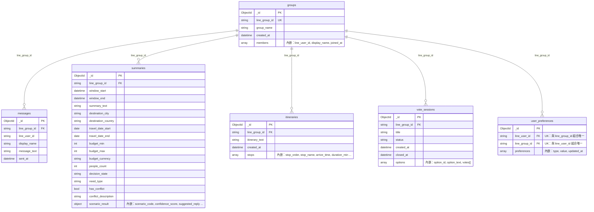

# 資料庫設計文件
**專案：** LINE 群組 AI 旅遊助理  
**資料庫：** MongoDB Atlas（文件型 NoSQL）  
**資料庫名稱：** `linebot`  
**版本：** 1.0  
**日期：** 2026-05-24  

---

## 一、Collection 關係圖（ERD）

> 說明：MongoDB 使用 `line_group_id` / `line_user_id` 做跨 Collection 的邏輯參照。  
> 內嵌文件（members、stops、options 等）以巢狀方式表示。

---

## 二、Collection Schema（資料字典）

### 2.1 groups

儲存 LINE 群組基本資訊，成員清單直接內嵌。

| 欄位 | 型態 | 必填 | 說明 |
|------|------|------|------|
| `_id` | ObjectId | 是 | MongoDB 自動產生主鍵 |
| `line_group_id` | string | 是 | LINE 群組 ID（唯一，如 `C1234...`） |
| `group_name` | string | 否 | 群組名稱 |
| `created_at` | datetime | 是 | 首次記錄時間（UTC） |
| `members` | array | 是 | 成員清單（見下方內嵌結構） |

**members 內嵌結構：**

| 欄位 | 型態 | 說明 |
|------|------|------|
| `line_user_id` | string | LINE 使用者 ID |
| `display_name` | string | 顯示名稱 |
| `joined_at` | datetime | 加入時間（UTC） |

---

### 2.2 messages

儲存群組內每一筆使用者訊息，為 AI 分析提供對話歷史。

| 欄位 | 型態 | 必填 | 說明 |
|------|------|------|------|
| `_id` | ObjectId | 是 | 自動產生主鍵 |
| `line_group_id` | string | 是 | 所屬群組 ID |
| `line_user_id` | string | 是 | 發送者 LINE ID |
| `display_name` | string | 否 | 發送者顯示名稱 |
| `message_text` | string | 是 | 訊息內容 |
| `sent_at` | datetime | 是 | 發送時間（UTC） |

---

### 2.3 summaries

儲存每次 AI 分析的結論與情境判斷結果，scenario_result 直接內嵌。

| 欄位 | 型態 | 必填 | 說明 |
|------|------|------|------|
| `_id` | ObjectId | 是 | 自動產生主鍵 |
| `line_group_id` | string | 是 | 所屬群組 ID |
| `window_start` | datetime | 是 | 分析時間視窗起點 |
| `window_end` | datetime | 是 | 分析時間視窗終點 |
| `summary_text` | string | 否 | 對話摘要文字 |
| `destination_city` | string | 否 | 目的地城市 |
| `destination_country` | string | 否 | 目的地國家 |
| `travel_date_start` | date | 否 | 旅遊開始日期 |
| `travel_date_end` | date | 否 | 旅遊結束日期 |
| `budget_min` | int | 否 | 最低預算 |
| `budget_max` | int | 否 | 最高預算 |
| `budget_currency` | string | 否 | 幣別（預設 `TWD`） |
| `people_count` | int | 否 | 出遊人數 |
| `decision_state` | string | 否 | `討論中` / `確認中` / `已決定` |
| `need_type` | string | 否 | AI 判斷的需求類型 |
| `has_conflict` | bool | 是 | 是否有意見衝突 |
| `conflict_description` | string | 否 | 衝突描述 |
| `scenario_result` | object | 否 | AI 情境判斷結果（見下方） |

**scenario_result 內嵌結構：**

| 欄位 | 型態 | 說明 |
|------|------|------|
| `scenario_code` | string | 情境代碼（如 `劇本四`） |
| `scenario_name` | string | 情境名稱 |
| `should_intervene` | bool | 是否介入 |
| `intervention_type` | string | `顯性介入` / `隱性介入` / `不介入` |
| `confidence_score` | decimal | 信心分數（0.0 ~ 1.0） |
| `suggested_reply` | string | AI 建議回覆文字 |

---

### 2.4 itineraries

儲存 AI 產生的旅遊行程，站點清單直接內嵌。

| 欄位 | 型態 | 必填 | 說明 |
|------|------|------|------|
| `_id` | ObjectId | 是 | 自動產生主鍵 |
| `line_group_id` | string | 是 | 所屬群組 ID |
| `itinerary_text` | string | 否 | 行程描述文字 |
| `created_at` | datetime | 是 | 建立時間（UTC） |
| `stops` | array | 是 | 行程站點清單（見下方） |

**stops 內嵌結構：**

| 欄位 | 型態 | 說明 |
|------|------|------|
| `stop_order` | int | 站點順序（從 1 開始） |
| `stop_name` | string | 地點名稱 |
| `stop_address` | string | 地址 |
| `arrive_time` | string | 預計到達時間（`HH:MM`） |
| `duration_min` | int | 預計停留分鐘數 |
| `category` | string | 類別（`景點` / `餐廳` / `交通`） |

---

### 2.5 vote_sessions

儲存投票主題，選項與投票紀錄直接內嵌。

| 欄位 | 型態 | 必填 | 說明 |
|------|------|------|------|
| `_id` | ObjectId | 是 | 自動產生主鍵 |
| `line_group_id` | string | 是 | 所屬群組 ID |
| `title` | string | 是 | 投票標題 |
| `status` | string | 是 | `進行中` / `已結束` |
| `created_at` | datetime | 是 | 建立時間（UTC） |
| `closed_at` | datetime | 否 | 結束時間（UTC） |
| `options` | array | 是 | 投票選項（見下方） |

**options 內嵌結構：**

| 欄位 | 型態 | 說明 |
|------|------|------|
| `option_id` | int | 選項編號 |
| `option_text` | string | 選項文字 |
| `votes` | array | 已投票的使用者清單（`line_user_id`、`voted_at`） |

---

### 2.6 user_preferences

儲存使用者在特定群組的個人偏好，多筆偏好合併為陣列。

| 欄位 | 型態 | 必填 | 說明 |
|------|------|------|------|
| `_id` | ObjectId | 是 | 自動產生主鍵 |
| `line_user_id` | string | 是 | LINE 使用者 ID |
| `line_group_id` | string | 是 | 所屬群組 ID |
| `preferences` | array | 是 | 偏好清單（見下方） |

> `line_user_id` + `line_group_id` 組合唯一。

**preferences 內嵌結構：**

| 欄位 | 型態 | 說明 |
|------|------|------|
| `type` | string | 偏好類型（如 `飲食`、`交通`、`住宿`） |
| `value` | string | 偏好值（如 `不吃辣`、`不開車`） |
| `updated_at` | datetime | 最後更新時間（UTC） |

---

## 三、索引設計

| Collection | 索引欄位 | 類型 | 目的 |
|---|---|---|---|
| `groups` | `line_group_id` | 唯一索引 | 快速查找群組、防重複建立 |
| `messages` | `line_group_id` + `sent_at DESC` | 複合索引 | 取得群組最近 N 筆訊息 |
| `messages` | `line_user_id` | 單欄索引 | 查詢特定使用者訊息 |
| `summaries` | `line_group_id` + `window_start DESC` | 複合索引 | 取得群組最新分析結果 |
| `itineraries` | `line_group_id` + `created_at DESC` | 複合索引 | 取得群組最新行程 |
| `vote_sessions` | `line_group_id` + `status` | 複合索引 | 查詢進行中的投票 |
| `user_preferences` | `line_user_id` + `line_group_id` | 唯一複合索引 | 快速查找偏好、防重複 |

---

## 四、設計決策說明

### 從 10 個 SQL 表縮減為 6 個 Collection？

| 決策 | 原因 |
|------|------|
| `users` 不獨立存 | LINE 使用者資訊分散在各 Collection，查詢不需要單獨一張表 |
| `group_members` 內嵌進 `groups` | 群組與成員永遠一起讀，內嵌減少查詢次數 |
| `scenario_results` 內嵌進 `summaries` | 每次分析只有一個最終情境結果，一對一關係適合內嵌 |
| `itinerary_stops` 內嵌進 `itineraries` | 站點不會脫離行程單獨存取，內嵌符合存取模式 |
| `vote_options` + `votes` 內嵌進 `vote_sessions` | 投票結果需要原子性操作，內嵌確保一致性 |

### 時間統一使用 UTC
所有 `datetime` 欄位儲存 UTC 時間，顯示時由前端或應用層轉換為 UTC+8（台灣時間）。
